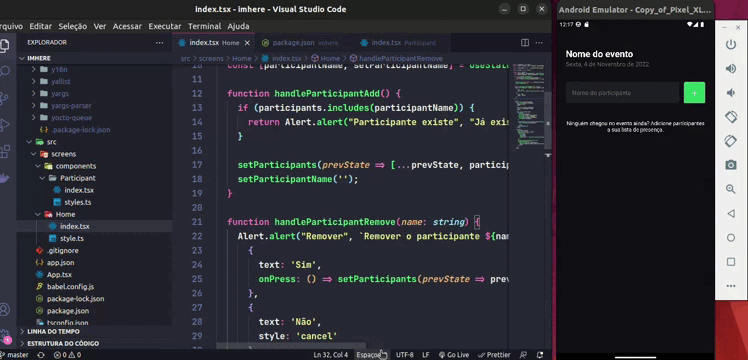

<div align="center" id="top"> 
  

&#xa0;

</div>

<h3 align="center">
  Criando uma aplicação de controle de participantes 
</h3>

<p align="center">
  <a href="#-projeto">Projeto</a>&nbsp;&nbsp;&nbsp;|&nbsp;&nbsp;&nbsp;
  <a href="#-conceitos">Conceitos Abordados</a>&nbsp;&nbsp;&nbsp;|&nbsp;&nbsp;&nbsp;
  <a href="#-tecnologias">Tecnologias</a>&nbsp;&nbsp;&nbsp;|&nbsp;&nbsp;&nbsp;
  <a href="#-layout">Layout</a>&nbsp;&nbsp;&nbsp;|&nbsp;&nbsp;&nbsp;
  <a href="#licença">Licença</a>
</p>

&#xa0;

## :rocket: Sobre o projeto

 <p align="center">
 
 </p>
 
 I'm here é um aplicativo com apenas uma tela onde você consegue cadastrar e remover participantes.

## Conceitos abordados

- Estados
- Imutabilidade do estado
- Componentização
- ScrowView e Flatlist
- Status bar
- Exibição de alertas

  &#xa0;

## 💻 Tecnologias

As seguintes ferramentas foram usadas na construção do projeto:

- [Node.js](https://nodejs.org/en/)
- [React-Native](https://reactnative.dev/)
- [TypeScript](https://www.typescriptlang.org/)
- [Expo](https://expo.dev/)


&#xa0;

## :memo: Pré requisitos

Antes de começar, você precisa ter o [Git](https://git-scm.com) e o [Node](https://nodejs.org/en/) instalados em sua maquina.

&#xa0;

## :wrench: Começando

```bash
# Clone este repositório
$ git clone https://github.com/guiaquinodev/imhere


# Entre na pasta
$ cd imhere

# Instale as dependências
$ yarn ou $ npm i

# Para iniciar o projeto
$ yarn start ou $ npm run start

# O app vai inicializar em <http://localhost:3000>
```

&#xa0;

## :thinking: Como contribuir

Se você deseja contribuir com o projeto, basta fazer um fork do repositório, criar uma branch com sua feature, fazer commit das alterações, fazer push para a sua branch e, quando o merge da sua pull request for realizado, deletar a sua branch.

&#xa0;

## ✔️ Licença

Este projeto está sob licença MIT. Veja o arquivo [LICENSE](LICENSE.md) para mais detalhes.

&#xa0;

<div align="center">
Feito com :heart: por <a href="https://github.com/guiaquinodev" target="_blank">Guilherme Aquino</a>
</div>
